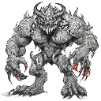
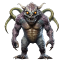
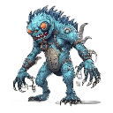

# Sprite Generator

Super simple AI sprite generator using sd3.5 or SDXL. It just uses a simple remove background to replace the background
with transparency. Unfortunately this is not generating view from multiple angles, it just generates an image and removes the background

## Example Sprites

Here are some example sprites generated with this tool:

<div style="display: flex; gap: 20px;">
  <div>
    
    <p>Sprite 1</p>
  </div>
  <div>
    
    <p>Sprite 2</p>
  </div>
  <div>
    
    <p>Sprite 3</p>
  </div>
</div>

These sprites are stored in the `sprites` folder and were generated using the SD3.5 model.

## Features

- Generate sprites using AI models (SD3.5, SDXL, SaanaV2)
- Background removal with transparent alpha channel
- Resize and pixelize images to create sprites
- Simple command-line interface
- Basic Streamlit web interface
- Batch generation option
- Saves sprites to timestamped folders
- Configurable Hugging Face cache directory

## Installation

```bash
# Clone the repository
git clone https://github.com/jloveric/sprite-generator.git
cd sprite-generator

# Install with Poetry
poetry install
```

## Usage

### Streamlit Web Interface

```bash
# Run the Streamlit app
streamlit run app.py
```

This will start a local web server and open the Sprite Generator app in your browser. The app allows you to:

- Enter a text prompt
- Select a model (SD3.5, SDXL, SaanaV2)
- Choose the number of sprites to generate in a batch
- Adjust sprite size and other generation parameters
- Save all generated sprites to a timestamped directory
- Download individual sprites directly from the browser

### Command Line Interface

```bash
# Generate a sprite
poetry run sprite-gen generate --prompt "a red dragon" --output dragon.png

# Generate multiple sprites in a batch
poetry run sprite-gen generate --prompt "a red dragon" --output dragon.png --batch-size 4

# List available models
poetry run sprite-gen list-models

# Get help
poetry run sprite-gen --help
poetry run sprite-gen generate --help
```

### CLI Options

- `--prompt, -p`: Text prompt for image generation (required)
- `--output, -o`: Output path for the generated sprite (required)
- `--model, -m`: Model to use (sd3.5, sdxl, saana) (default: sd3.5)
- `--sprite-width`: Width of the output sprite (default: 128)
- `--sprite-height`: Height of the output sprite (default: 128)
- `--negative-prompt`: Negative prompt to guide generation away from certain attributes
- `--gen-width`: Width of the generated image before resizing (default: 1024)
- `--gen-height`: Height of the generated image before resizing (default: 1024)
- `--steps`: Number of denoising steps (default: 30)
- `--guidance-scale`: Scale for classifier-free guidance (default: 7.5)
- `--seed`: Random seed for reproducibility (optional)
- `--batch-size`: Number of sprites to generate (default: 1)
